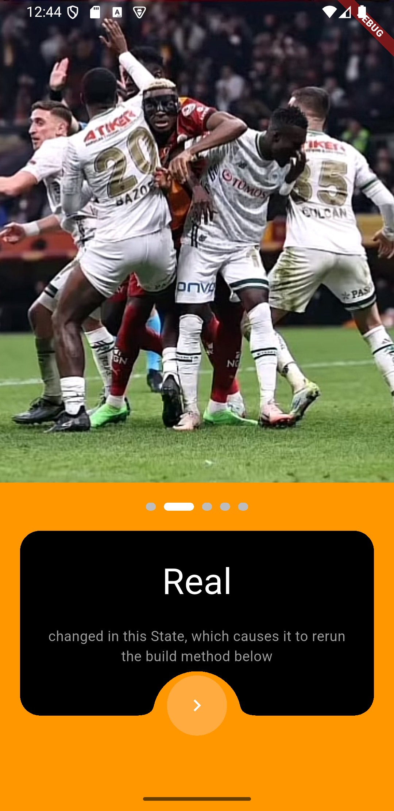
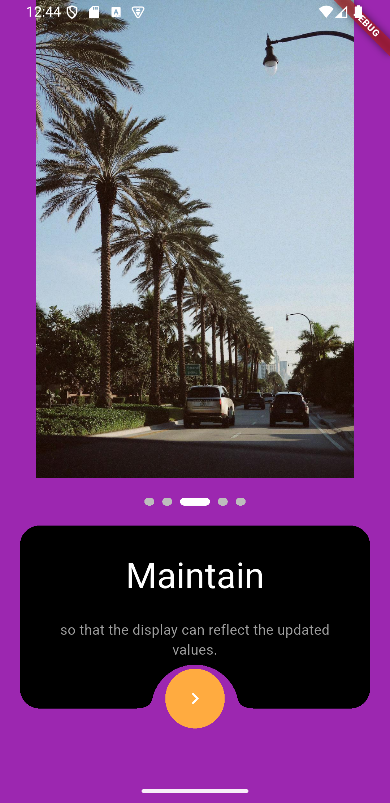
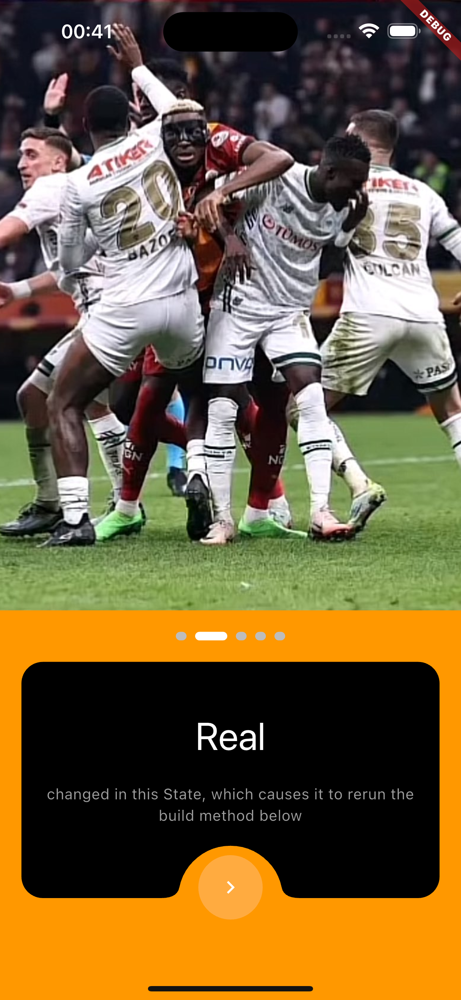
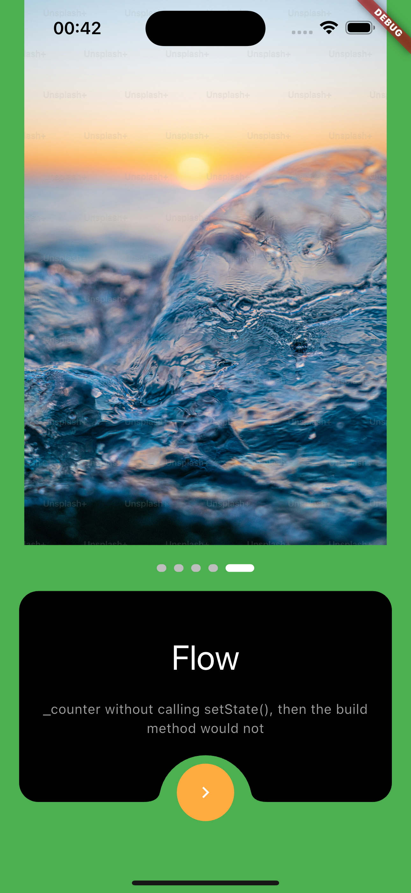

# cb_intros

A visually appealing and customizable onboarding/intro screen widget for your Flutter applications.


[](https://pub.dev/packages/cb_intros)
[](https://github.com/connelevalsam/cb-intros.git)

## Features

* **Flexible Content:** Display any widget on each page, not just images.
* **Smooth Page Transition:**  Provides a smooth `PageView` for a seamless onboarding experience.
* **Customizable Appearance:** Control the background colors, text content (titles and
  descriptions), button color, and padding.
* **Animated Page Indicator:** Includes a visually appealing smooth page indicator to show progress.
* **Unique Design:** Features a distinctive "side-cut" design for the text and button area.
* **Easy Integration:** Simple to add to any Flutter project.
* **Animations:** Uses `flutter_animate` for subtle and engaging animations.

## Screenshots/GIFs (Replace with your actual media)

<!-- Add screenshots or GIFs here to showcase your package visually -->

 |
 |
 |


## Getting Started

1. **Add the dependency:**
   ```yaml
   dependencies:
     cb_intros: ^0.2.3
   ```
2. **Install the package:**
   ```bash
   flutter pub get
   ```
3. **Import it:**
   ```dart
   import 'package:cb_intros/cb_intros.dart';
   ```

## Usage

Here's a basic example of how to use `CbIntros`:

```dart
import 'package:cb_intros/cb_intros.dart';
import 'package:flutter/material.dart';
import 'package:flutter_animate/flutter_animate.dart';

void main() {
  runApp(const MyApp());
}

class MyApp extends StatelessWidget {
  const MyApp({super.key});

  @override
  Widget build(BuildContext context) {
    return MaterialApp(
      title: 'CBIntros Demo',
      debugShowCheckedModeBanner: false,
      theme: ThemeData(
        colorScheme: ColorScheme.fromSeed(seedColor: Colors.deepPurple),
      ),
      home: const MyHomePage(title: 'CBIntros Demo Home Page'),
    );
  }
}

class MyHomePage extends StatefulWidget {
  const MyHomePage({super.key, required this.title});

  final String title;

  @override
  State<MyHomePage> createState() => _MyHomePageState();
}

class _MyHomePageState extends State<MyHomePage> {
  final List<Widget> items = [
    Image.network(
      'https://images.pexels.com/photos/1640777/pexels-photo-1640777.jpeg?auto=compress&cs=tinysrgb&w=1260&h=750&dpr=2',
      fit: BoxFit.cover,
      width: double.infinity,
    ),
    Image.network(
      'https://images.pexels.com/photos/376464/pexels-photo-376464.jpeg?auto=compress&cs=tinysrgb&w=1260&h=750&dpr=2',
      fit: BoxFit.cover,
      width: double.infinity,
    ),
    const Icon(
      Icons.payment,
      size: 200,
      color: Colors.white,
    ),
    Image.network(
      'https://images.pexels.com/photos/958545/pexels-photo-958545.jpeg?auto=compress&cs=tinysrgb&w=1260&h=750&dpr=2',
      fit: BoxFit.cover,
      width: double.infinity,
    ),
  ];
  final List<Color> colors = [
    Colors.black,
    Colors.orange,
    Colors.purple,
    Colors.red,
  ];
  final List<String> title = [
    "Healthy Food",
    "Fast Delivery",
    "Easy Payment",
    "Enjoy",
  ];
  final List<String> desc = [
    "Order healthy and fresh food online from the comfort of your home.",
    "We deliver your order to your doorstep in a very short time.",
    "Pay for your order using any of our easy payment methods.",
    "Enjoy your meal with your family and friends.",
  ];

  final List<Effect> animationEffects = [
    const FlipEffect(duration: Duration(seconds: 1)),
    const FadeEffect(delay: Duration(seconds: 1)),
  ];

  void moveToNextScreen() {
    ScaffoldMessenger.of(context).showSnackBar(
      const SnackBar(content: Text('Onboarding Finished!')),
    );
  }

  @override
  Widget build(BuildContext context) {
    return Scaffold(
      body: CbIntros(
        items: items,
        colors: colors,
        titles: title,
        desc: desc,
        moveToNextScreen: moveToNextScreen,
        appPadding: 20,
        boxHeight: 300,
        boxColor: Colors.white,
        btnColor: Colors.deepPurple,
        indicatorActiveColor: Colors.deepPurple,
        titleContainer: (BuildContext context, String content) {
          return Text(
            content,
            style: Theme.of(context).textTheme.displaySmall?.copyWith(
                  color: Colors.black,
                  fontWeight: FontWeight.bold,
                ),
            textAlign: TextAlign.center,
          );
        },
        descContainer: (BuildContext context, String content) {
          return Text(
            content,
            style: Theme.of(context).textTheme.bodyMedium?.copyWith(
                  color: Colors.grey.shade600,
                ),
            textAlign: TextAlign.center,
          );
        },
        animationEffects: animationEffects,
        onPageChanged: (index) {
          // Track page changes
          debugPrint('Page changed to: $index');
        },
      ),
    );
  }
}
```

## Definition of Terms

*   **items:** A list of widgets to display on each page. This allows you to use `Image`, `Icon`, or any other widget.
*   **colors:** An array of colors that will be used as the background colors for each page.
*   **titles:** The title or main word of each screen (List<String>).
*   **desc:** The descriptions in each screens (List<String>).
*   **animationEffects:** The list of different animations from `flutter_animate` to apply to the item.
*   **moveToNextScreen:** Callback to execute after the last screen (e.g., navigation).
*   **boxHeight:** The height of the bottom box with the button curves.
*   **appPadding:** The vertical padding around the indicator.
*   **boxColor:** A preferred color for the bottom box.
*   **titleContainer:** A builder function `(context, content)` to style and display the title.
*   **descContainer:** A builder function `(context, content)` to style and display the description.
*   **onPageChanged:** Callback when the page changes, providing the current index.
*   **btnColor:** Color of the next/finish button circle.
*   **btnIconColor:** Color of the icon inside the button.
*   **btnIcon:** IconData for the button.
