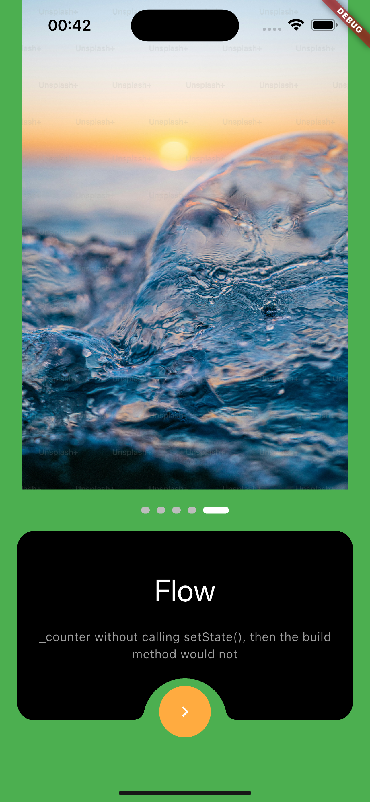

# cb_intros

A visually appealing and customizable onboarding/intro screen widget for your Flutter applications.

## Features

* **Smooth Page Transition:**  Provides a smooth `PageView` for a seamless onboarding experience.
* **Customizable Appearance:** Control the background colors, image assets, text content (titles and
  descriptions), button color, and padding.
* **Animated Page Indicator:** Includes a visually appealing smooth page indicator to show progress.
* **Unique Design:** Features a distinctive "side-cut" design for the text and button area.
* **Easy Integration:** Simple to add to any Flutter project.
* **Animations:** Uses `flutter_animate` for subtle and engaging animations.

## Screenshots/GIFs (Replace with your actual media)

<!-- Add screenshots or GIFs here to showcase your package visually -->

 |
 |
 |

## Getting Started

1. **Add the dependency:**
2. **Install the package:**
3. **Import it:**

## Usage

Here's a basic example of how to use `CbIntros`:

    import 'package:cb_intros/cb_intros.dart';
    import 'package:flutter/material.dart';
    
    void main() {
    runApp(const MyApp());
    }
    
    class MyApp extends StatelessWidget {
        const MyApp({super.key});
    
        // This widget is the root of your application.
        @override
        Widget build(BuildContext context) {
            return MaterialApp(
                title: 'CBIntros Demo',
                theme: ThemeData(
                    colorScheme: ColorScheme.fromSeed(seedColor: Colors.deepPurple),
                ),
                home: const MyHomePage(title: 'CBIntros Demo Home Page'),
            );
        }
    }
    
    class MyHomePage extends StatefulWidget {
        const MyHomePage({super.key, required this.title});
    
        final String title;
    
        @override
            State<MyHomePage> createState() => _MyHomePageState();
        }
    
        class _MyHomePageState extends State<MyHomePage> {
            List<String> img = [
                'assets/images/image1.jpg',
                'assets/images/image2.png',
                ''https://images.pexels.com/photos/30694611/pexels-photo-30694611/free-photo-of-scenic-palm-tree-avenue-on-a-sunny-day.jpeg?auto=compress&cs=tinysrgb&w=1260&h=750&dpr=2',
                'assets/images/image3.svg',
            ];
            List<Color> colors = [
                Colors.blue,
                Colors.orange,
                Colors.purple,
                Colors.red
            ];
            List<String> title = [
                "Balance",
                "Real",
                "Maintain",
                "Diverse",
            ];
            List<String> desc = [
                "This call to setState tells the Flutter framework that something has",
                "changed in this State, which causes it to rerun the build method below",
                "so that the display can reflect the updated values. If we changed",
                "_counter without calling setState(), then the build method would not",
            ];
            
            int _currentPageIndex = 0;

            void _handlePageChanged(int newIndex) {
              setState(() {
                _currentPageIndex = newIndex;
                print("Current page index: $_currentPageIndex");
                // You can add any logic here based on the new index,
                // like showing/hiding elements, updating other parts of the UI, etc.
                if (_currentPageIndex == img.length) {
                // Example: trigger something on the last page
                  print("Reached the last page!");
                }
              });
            }
            
            moveToNextScreen() {
              print("The END...");
            }
            
            @override
            Widget build(BuildContext context) {
                return Scaffold(
                    body: CbIntros(
                        images: img,
                        colors: colors,
                        titles: title,
                        desc: desc,
                        moveToNextScreen: moveToNextScreen,
                        appPadding: 20,
                        boxHeight: 200.h,
                        boxColor: Colors.blueAccent,
                        titleContainer: (BuildContext context) {
                            return Text(
                                title[_currentPageIndex],
                                style: Theme.of(
                                    context,
                                ).textTheme.displaySmall?.copyWith(color: Colors.white),
                                textAlign: TextAlign.center,
                            );
                        },
                        descContainer: (BuildContext context) {
                            return Text(
                                desc[_currentPageIndex],
                                style: Theme.of(
                                    context,
                                ).textTheme.bodyMedium?.copyWith(color: Colors.grey.shade500),
                                textAlign: TextAlign.center,
                            );
                        },
                        onPageChanged: _handlePageChanged,
                    ),
                );
        }
    }

## Definition of Terms
**images:** An array of images that you want to use as the info images.
**colors:** An array of colors that will be used as the background colors.
**title:** The title or main word of each screen.
**desc:** The descriptions in each screens.
**moveToNextScreen:** You put your Navigator logic here. This triggers after the last screen.
**boxHeight:** The height of the box with the button curves.
**appPadding:** The padding around the widgets used in the box.
**boxColor:** A preferred color for the box.
**titleContainer:** The widget used to display the title. 
**descContainer:** The widget used to display the description. 
**onPageChanged:** The method that makes sure to keep track of the current page and index.
    
    
